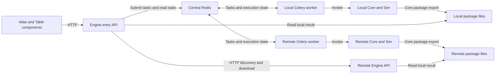

# DTCC Engine backend design

Date: 2026-09-06

Status: Design agreed in discussion; written specification ready for review.

## Purpose and authority

DTCC Engine exposes the Dataset capabilities of DTCC Core and DTCC Sim to
other DTCC Platform components. Atlas and Table are the initial consumers,
including the backend components supporting those experiences. Engine is a
Python integration service, not an application that end users operate directly.

This specification refines [DTCC Twin's design](../../docs/DESIGN.md) and follows
the [repository instructions](../../AGENTS.md) and
[Engine instructions](AGENTS.md). Core remains the authority
for Dataset definitions, DTCC Model semantics, input/output, validation, and
package contracts. Sim owns its simulation methods and specialized numerical
dependencies.

The first release provides discovery, asynchronous execution, job polling,
limited cancellation, and Dataset Package delivery. It delegates task execution
to Celery and uses one central Redis service for the broker and result backend.
It must not grow into a custom task queue, workflow engine, or cluster manager.

Engine evolves from Sim's existing mini-service and ultimately replaces it.
The intended end state is one maintained service implementation in Engine,
exposing both Core and Sim Dataset capabilities.

## Scope

### Included

- Generic discovery and invocation of all Core and Sim Dataset Definitions,
  including their supported semantic products and parameters within the input
  boundary below. There is no manually curated list of supported Dataset names.
- Requests containing Dataset parameters and geographic bounds.
- Asynchronous execution identified by a job ID, with status obtained by polling.
- Local execution and optional execution on configured remote compute hosts.
- Automatic placement with a local preference, and an explicit target per request.
- Concurrent jobs, limited by a configured job count on each compute host.
- One consumer-facing Engine HTTP address for submission, status, cancellation,
  and package downloads.
- A single shared configurable token for Engine HTTP authentication.
- Results delivered as `.dtccpkg` packages and retained for 30 days after
  completion, subject to the absence of recovery guarantees described below.
- Container deployments of the Engine production image on Linux hosts,
  self-hosted or on AWS EC2.

Each submitted job invokes one Dataset Definition. Dependencies and processing
steps internal to that Dataset remain in Core or Sim. Engine does not introduce
an application-level pipeline language or independently schedule the internal
stages of a Dataset.

All Datasets are in the integration scope, but availability is specific to an
execution environment. Missing dependencies, credentials, coverage, or canonical
exchange support must be reported where known. A missing upstream capability
does not justify a replacement implementation in Engine or a claim that full
Dataset coverage has been verified.

### Downstream responsibilities

Engine hands completed packages to downstream consumers. Those components own
durable storage, Package Catalogs, publication, access policies for saved data,
Twin Workspaces, Published Twins, and Table Catalog Releases. Engine's temporary
result storage is not a Package Catalog, and downloading or retaining a result
does not publish it.

Table's ordinary visitor experience continues to consume prepared, curated,
published content as specified by Twin's design. This backend does not change
Table into a live generation or simulation client. The initial shared API token
does not enforce different permissions for Atlas and Table.

### Deferred or excluded from v1

- Guaranteed persistence, restart recovery, job resumption, and high availability.
- Uploaded `.dtccpkg` inputs and other user-data upload or import workflows.
- Individual export-file download endpoints; delivery uses `.dtccpkg` only.
- Per-consumer tokens, roles, permissions, and quotas.
- Streaming status, server-sent events, callbacks, and completion webhooks.
- Automatic job retries, failover resubmission, and movement of accepted jobs
  between hosts.
- Guaranteed cancellation of running computations or custom solver interruption.
- CPU- or memory-aware scheduling, distributed capacity reservations, autoscaling,
  dynamic host registration, host provisioning, and SSH execution.
- Compatibility with arbitrary remote service APIs or legacy application layouts.
- Engine-owned serialization, simulation, publication, or domain data models.
- Native (non-container) installations and macOS hosts as deployment targets,
  and multi-host MPI execution of a single job.

## Runtime architecture

One deployment contains:

1. A consumer-facing Engine HTTP service.
2. One central Redis service, configured as Celery's broker and result backend.
3. A Celery worker on each configured compute host, including the local host.
4. The same Engine HTTP service on remote hosts for host-local discovery and
   package retrieval.
5. A temporary package directory on each executing host.

Every compute host runs the same Engine production image, which contains the
Engine software and the Core/Sim capabilities. The HTTP service and Celery
worker are separate containers from that image. Remote hosts do not require their own
Redis instance. A local-only deployment uses the same architecture with an
empty remote-host list.

Workers execute Core/Sim Python APIs in their own environment. Celery owns the
queue, worker processes, execution state, and worker concurrency. Engine owns
the small amount of application coordination needed to select a configured
target, expose upstream contracts, translate job status, and deliver packages.

There is one job and one Celery task per Dataset invocation. Remote execution
does not create a central task that waits for another task over HTTP. The
selected worker executes the Dataset directly and does not forward it again.

Task dispatch uses the shared broker. Consumer requests, host-local discovery,
and package transfers use HTTP.

## Service evolution and replacement

Sim's existing mini-service is the starting point for Engine's service layer.
Reuse and adapt its applicable Dataset task integration, progress reporting,
HTTP behavior, and tests. Move service responsibilities into Engine while
keeping Dataset definitions, model semantics, and computation in Core and Sim.
Packaging improvements remain Core-owned upstream work.

The migration must identify existing service consumers and deployment entry
points, specify their transition to Engine, and verify the required replacement
behavior. Temporary coexistence is permitted during that transition. The final
architecture must not retain independently maintained Sim and Engine services
for the same responsibilities.

Once Engine satisfies the agreed acceptance checks and existing consumers have
transitioned, retire the original mini-service implementation and its deployment
entry points from Sim through a separate upstream change. That retirement is
part of completing the migration; it does not remove Sim's Dataset definitions
or numerical capabilities. Reference checkouts remain unchanged during Engine
work.

Core's `RemoteDatasetDescriptor` is a Python client, not the mini-service being
replaced. Engine workers invoke local Dataset APIs directly and do not use that
client for internal task dispatch. Adapting existing Python clients to Engine's
API, or changing the remote Dataset client's lifecycle, requires a separate
Core compatibility decision. Replacing the Sim mini-service does not itself
authorize removing the Core client.

## Discovery and compatibility

Dataset descriptors and argument schemas come from Core's public registry and
Dataset interface. Importing Sim contributes its Dataset Definitions through
that same registry. Engine exposes those definitions with application metadata
about configured targets and observed availability. This is a discovery view,
not a competing Dataset registry.

Engine returns each registered Dataset's Core `describe()` output unchanged,
keyed by Dataset name. It does not filter Datasets by package, infer formats
from schemas, or supply default values for missing descriptor fields. The
listing also reports the installed Engine, Core, and Sim versions and a catalog
revision: a SHA-256 digest of the versions and descriptions, which changes
whenever either changes. Engine reads the registry on each request, so the
revision is the catalog's refresh mechanism; newly installed Python code still
requires restarting the Engine processes.

Each target reports its own local capabilities and installed Engine, Core, and
Sim versions. Host-local discovery must not recursively query other hosts.
The consumer-facing service combines this information for discovery and target
selection. A remote-only capability can be discovered without executing it on
the entry host. Because every host in a deployment runs the same image, a
capability is remote-only because of that host's runtime conditions, such as
credentials, data, hardware, or provider access, not because different code is
installed there.

The catalog must have an explicit refresh operation or revision mechanism. A
new conforming Dataset using existing contracts becomes visible after it is
installed and registered on a target and the catalog is refreshed, without
Dataset-specific changes to Engine. In a deployment, new Python code arrives in
a new image rolled out to every host, which requires restarting the containers;
discovery is not a promise of arbitrary live code loading.

A target is compatible only when its Dataset contract and execution environment
match the request and the deployment's tested compatibility baseline. Record
the versions used to execute each job and preserve upstream provenance in the
resulting package. Reject incompatible targets rather than silently changing
parameters, semantic products, or model meaning.

Compatibility and canonical exchange readiness must be verified from source,
tests, and representative execution. A descriptor alone is not proof that a
solver is installed, a provider is reachable, or a returned type satisfies
Core's lossless Protobuf contract.

## Routing and concurrency

Remote hosts are configured explicitly with stable target identifiers and their
Engine HTTP addresses. They do not register dynamically. Use a Celery queue for
each configured compute target. Each host's worker consumes its designated
queue and enforces the configured concurrent-job count.

Requests select automatic placement, local execution, or a named remote target.

| Request or condition                                                                | Required behavior                                                                                                                                  |
| ----------------------------------------------------------------------------------- | -------------------------------------------------------------------------------------------------------------------------------------------------- |
| Automatic placement; local host is available, compatible, and has observed capacity | Submit to the local queue.                                                                                                                         |
| Automatic placement; local host is unavailable, lacks capacity, or is incompatible  | Select an available compatible remote host with observed capacity, in configuration order.                                                         |
| All reachable compatible hosts are busy                                             | Queue locally if the local host is compatible and available; otherwise queue on the first available compatible remote host in configuration order. |
| Explicit local or remote target is busy                                             | Queue on that target.                                                                                                                              |
| Explicit target is unavailable, unknown, or incompatible                            | Reject the request with an explanation; do not substitute another target.                                                                          |
| No compatible available target exists                                               | Reject the request with an explanation.                                                                                                            |

Availability means that a target can accept queued work; capacity means that it
appears to have room to start another job. A busy target can still be available.
HTTP liveness alone must not be treated as proof that its Celery worker is ready.

Reported load is a placement hint. Concurrent submissions can observe the same
capacity, so automatic placement does not guarantee immediate execution. Celery
enforces the actual job-count limit. Engine must not add a distributed slot
reservation protocol to make the placement hint exact.

After submission, a job remains assigned to its selected host. There is no
rebalancing, work stealing, or automatic rerouting when that host becomes busy
or unavailable. There are no CPU or memory resource estimates in v1 scheduling.

## Consumer API contract

Engine provides the following operations through its versioned HTTP API. The
implementation plan will select concrete route and module names while
preserving these operation contracts.

| Operation                 | Input                                                                                           | Output                                                                                                                    |
| ------------------------- | ----------------------------------------------------------------------------------------------- | ------------------------------------------------------------------------------------------------------------------------- |
| List or describe Datasets | Optional Dataset identity                                                                       | Upstream descriptors, parameter schemas, supported semantic products, and target availability.                            |
| List compute targets      | No Dataset request required                                                                     | Configured target identifiers, versions, local capabilities, and observed availability.                                   |
| Submit a job              | Dataset name, parameter object including bounds where applicable, and optional execution target | Accepted job ID and a status reference; no wait for Dataset completion.                                                   |
| Get job status            | Job ID                                                                                          | Execution state, available progress, useful error information, cancellation-request information, and result availability. |
| Download a result         | Completed job ID                                                                                | The validated `.dtccpkg` archive.                                                                                         |
| Request cancellation      | Job ID                                                                                          | Whether cancellation was requested, is already resolved, or is unsupported for the job's current execution state.         |

Consumer requests are JSON-compatible descriptions of Dataset invocations. They
do not carry Python model objects, uploaded data, arbitrary code, or arbitrary
execution-host URLs. An explicit execution target must resolve to a configured
identifier.

Core's existing Dataset contract validates Dataset arguments before execution;
Engine validates only its own request envelope and target selection. The
selected target's authoritative contract must be used for validation. Engine
must not maintain hand-written copies of Dataset argument models.

Bounds, units, coordinate reference systems, dimensionality, and parameter
defaults follow the selected Core/Sim Dataset contract. Engine must not
reinterpret numeric bounds as another coordinate system or silently fill
scientific choices using application-specific assumptions.

Semantic product selection remains a Dataset parameter. The delivery container
is `.dtccpkg`; it must not be confused with a Dataset's legacy `format=` path
that returns serialized bytes. Any choice of supplementary package artifacts
must use Core's export contract and must not trigger a second Dataset
computation merely to serialize an existing realization.

Job status distinguishes queued, running, completed, failed, and confirmed
cancelled work. A job whose submission the broker did not confirm is
unconfirmed rather than queued, because it may or may not be queued; it is
reported as running once a worker starts it, and Engine never sends it again.
Cancellation being requested is separate information from
confirmation that work was cancelled. Unknown or expired jobs and temporary
status unavailability must be distinguishable from queued work.

Progress reports upstream measurements and messages when available. A running
job without measured progress must not be given an invented percentage or
completion estimate. Consumers obtain updates by polling; streaming is outside
the first release.

## Package creation, delivery, and retention

The worker invokes the Dataset to obtain its native DTCC Model realization with
Dataset Context. It uses Core's object/package export capabilities to create
the `.dtccpkg` archive. It must not duplicate serializers, manifests, package
validation, or Protobuf handling in Engine.

For semantic DTCC data, every delivered package must include:

- An authoritative manifest containing Dataset identity, the exact request,
  provenance, health, warnings, and artifact information.
- A canonical DTCC Protobuf model artifact satisfying Core's versioned,
  lossless model-exchange contract.
- Any additional artifacts provided through Core's package contract, with their
  roles and relationships described by the manifest.

Intrinsic model facts belong in the canonical model. Dataset request and
provenance context belong in the manifest. Consumers use the manifest to select
artifacts rather than infer meaning from filenames. A derived image or mesh
export cannot replace the canonical model artifact.

Before offering a download, use Core's validated package boundary to check the
required content, schema compatibility, model type, and artifact integrity.
Packages under construction must not be exposed as completed results. Required
packaging or integrity failures fail result delivery clearly. A valid
realization remains valid if an optional presentation artifact fails; Core's
contract must determine whether a complete package can be emitted with the
appropriate warning.

The executing host stores the completed package. Redis stores job state and
references to the package and host, not archive contents or in-memory model
objects. The public Engine address serves local files or streams the remote
archive through the remote host's Engine HTTP API. No shared filesystem between
hosts is required, and forwarding a download does not require a second stored
copy at the entry host.

Completed packages expire 30 days after job completion, measured as 30 periods
of 24 hours using UTC timestamps. Downloads do not extend that period. Under
normal operation, job-result metadata must remain available throughout the
package retention window. Each host must automatically clean up expired package
files; broker metadata expiry alone is insufficient. Host outages can delay physical cleanup,
but expired packages must not become newly available merely because their files
remain on disk.

The 30-day period is a temporary retention policy, not a persistence guarantee.
Downstream consumers must store results they need to retain durably.

## Failures, cancellation, and restarts

### Failure reporting

- Invalid requests fail before submission, with the selected Dataset's useful
  validation details.
- Dataset failures and required package-creation failures produce failed jobs.
  Incomplete packages are not downloadable.
- Failed jobs require explicit consumer resubmission. Engine adds no automatic
  execution retries or failover resubmission.
- Broker or host communication failure means the latest state may be
  unavailable. It must not be reported as proof that the computation failed or
  stopped. If submission acknowledgement is lost, acceptance can be uncertain;
  Engine must not silently submit the job again.
- An unknown or expired job ID is identified explicitly. Celery's `PENDING`
  value alone cannot establish that a job was accepted and is queued, as
  documented in its [task states](https://docs.celeryq.dev/en/stable/userguide/tasks.html#pending).
- Returning an error must not expose the API token, provider credentials, or
  unrestricted internal tracebacks. Operational diagnostics can retain the
  information needed to investigate the job.

No exactly-once execution or duplicate-submission guarantee is introduced by
this specification. Broker reconnection and read-only status polling do not
constitute permission for Engine to retry a Dataset computation.

### Cancellation

V1 supports best-effort cancellation before execution starts, using existing
Celery facilities. If cancellation races with execution starting, the job may
run. Accepting a cancellation request must not be presented as proof that
running work has stopped.

Running-job cancellation is deferred. Engine must not copy the existing Sim
service's programmatic `terminate=True` behavior as a general cancellation API.
Celery's [worker documentation](https://docs.celeryq.dev/en/stable/userguide/workers.html#revoke-revoking-tasks)
explains that this terminates a worker process and can affect a different task
if that process has already moved on. Confirmation and race handling must be
checked against the selected Celery version before exposing a
terminal cancelled state.

No custom interruption hooks, process-management framework, or solver-specific
cancellation implementation are included in the first release.

### Restart behavior

V1 provides **no guaranteed recovery after restart** for queued jobs, running
jobs, job records, or completed packages. It does not deliberately cancel jobs
or delete surviving results simply because the HTTP API restarts. Usable work
that survives through the broker, workers, or filesystem can remain usable.

There is no additional coordination mechanism whose purpose is to erase
surviving jobs. Guaranteed persistence, recovery, and resumption are explicitly
deferred requirements for a later release.

## Deployment and authentication

The deployment target is Linux hosts, self-hosted or on AWS EC2, running
containers from the Engine production image described below. Native
installations and macOS hosts are not deployment targets; macOS is used only
for development through Docker. Kubernetes is not required. Use the container
runtime's restart policies and Celery operations rather than building a service
manager into Engine.

Configuration supplies the central broker/result-backend connection, one
shared Engine HTTP token, the local target identity, the static remote-target
list, per-host concurrent-job limits, and local temporary result directories.
All Engine HTTP services use the shared token; there are no per-consumer roles.
The only exception is an unauthenticated health route that reports liveness and
returns no Dataset, job, or version information, so that process supervisors
and Compose can probe the service. The token must use the RFC 6750 bearer-token
characters; Engine refuses to start with an empty or malformed token, because
such a token could never match a well-formed `Authorization` header.
Broker connectivity has its own deployment configuration and protection; an
HTTP API token is not a Redis authentication protocol.

Compute hosts need connectivity to central Redis. The entry service needs HTTP
connectivity to remote Engine APIs for discovery and result transfer. Consumers
need only the entry service's HTTP address. Public-network deployments must
protect credentials and data in transit through their deployment configuration.

Each compute host runs the Engine HTTP service and the Celery worker as separate
containers from the same production image. A production deployment provides:

- TLS termination by a reverse proxy in front of the entry service; Engine's
  HTTP port is not exposed directly to a public network.
- The API token as a secret; the production image has no default token.
- A persistent volume for the local temporary package directory, so completed
  packages survive container restarts during the retention period.
- A persistent volume for the FEniCSx form-compilation cache, so restarts do
  not recompile the forms of every simulation.
- Shared memory sized for MPI and PETSc, because Docker's default of 64 MB is
  insufficient, and thread-count settings such as `OMP_NUM_THREADS` that match
  the CPUs allocated to each job.
- An external Redis service.

The image digest identifies the complete environment: Engine, Core, Sim,
Celery, Python, and the numerical stack. In v1, every host in a deployment runs
the `linux/amd64` image, and hosts are compatible when they run the same
platform-specific image digest (not a multi-platform index, whose per-platform
images have different digests). The deployment supplies each host's digest to
its configuration so that discovery can report it. Image compatibility is
separate from runtime availability, which each host reports for itself. Distribution versions alone do
not identify the Core and Sim commits installed from Git. An environment that
can import Dataset descriptors is not automatically a working numerical
execution environment; worker execution and Sim's specialized dependencies
must be exercised in the production image on a Linux host.

## Engine image

One Dockerfile in `apps/engine/` defines two build targets. They share the
conda environment, TetGen wrapper, Core, and Sim layers, so development and
production run the same numerical stack.

- `dev` is used by the root `compose.yaml` for local development and tests. It
  installs the Engine package in editable mode with its test dependencies,
  mounts the source, and reloads on code changes. Developers on any operating
  system need Docker rather than a native numerical installation.
- `prod` is the deployment image. It installs the Engine package without its
  test extra, test files, source mounts, or reloading; runs as a non-root user;
  and keeps only the build tools needed at runtime, which is a C compiler,
  because FEniCSx compiles forms when a simulation runs. Its conda environment
  is resolved from a lock file. Test packages that Core itself depends on, such
  as pytest, remain until Core removes them upstream.
- The image's health check probes the HTTP service's health route. Worker
  containers override it with a Celery-specific check, because a worker serves
  no HTTP; both containers' health is verified.

Both targets follow these rules:

- One image serves both the Engine HTTP service and the Celery worker, matching
  the single installed package described in the runtime architecture.
- The image installs pinned commits of Core, Sim, and the TetGen wrapper,
  supplied as build arguments. Core's commit is the one that Sim's `uv.lock`
  records at Sim's pinned commit. Sim's package metadata asks for Core's
  `develop` branch, which pip would resolve to its head at build time, so the
  build installs Sim without its dependencies and fails unless the installed
  Core and Sim are the pinned commits. Taking Core's commit from Sim's lock
  file does not establish that the pair works; the checks run after a pin
  changes do. The build does not read the reference checkouts under `temp/`.
- The image includes TetGen because Core uses it to generate the volume meshes
  that Sim's FEniCSx simulations require. The wrapper and TetGen are licensed
  under AGPL-3.0. Review that license before pushing the image to any registry,
  including a private one; the review is a prerequisite for production
  deployment.
- The image targets `linux/amd64` only, in development and in production, so
  every check runs on the deployed architecture; Apple silicon runs it under
  Docker's emulation, which is slower. On Linux arm64, GCC contracts
  floating-point multiply-adds by default and Core's meshing then fails, and
  Core's continuous integration does not cover that platform. Supporting
  `linux/arm64`, such as AWS Graviton, requires that upstream fix and its own
  production validation.

For local development, the root `compose.yaml` places Engine services behind
the `engine` profile, so developers who work only on the frontend or backend
never build the image. The profile includes Redis, which both the HTTP service
and the worker use. Engine publishes its HTTP port on the loopback interface
only.

Engine's test suite runs in the `dev` target through `pnpm engine:check`. It is
not part of the repository-wide `pnpm check`, which does not build the image.
Its environment tests check that Core, Sim, FEniCSx, and the TetGen wrapper are
installed; that TetGen tetrahedralizes a unit cube; that FEniCSx assembles the
unit cube's volume and solves a small problem through PETSc; that the unit-cube
mesh round-trips through an HDF5 file read back by h5py; and that Core builds a
volume mesh of a small city.

The frontend does not call Engine directly. The shared Engine token must not be
exposed to browsers, so the Twin backend holds the token and forwards the Engine
requests that the frontend needs. The frontend continues to use only the
backend's `/api` address.

Passing tests in the `dev` target verify the shared environment layers.
Production acceptance requires the `prod` image running on a Linux host.

## Upstream inspection and implementation prerequisites

The following observations come from the revisions installed in the development
image, inspected through GitHub at those commits. They are source observations,
not claims of passing runtime tests or a verified release combination.

| Reference                         | Inspected revision                         |
| --------------------------------- | ------------------------------------------ |
| `dtcc-core`, from Sim's `uv.lock` | `2289d11f85049e13d5042e5cb3e5627c6568765f` |
| `dtcc-sim`                        | `0c9d1c4c9f00530a2ab89c82d8dfa6e17686a339` |
| `dtcc-tetgen-wrapper`             | `22ab9ff2ee1dd03f82ce24dd0f378f00da7e487c` |

### Reusable interfaces

- Core's `dtcc_core/datasets/registry.py` exposes the shared Dataset registry.
  `DatasetDescriptor` in `dtcc_core/datasets/dataset.py` provides validation,
  invocation, descriptions, and parameter schemas. Its public `Dataset` alias
  and actual contracts must be checked against the selected dependency revision.
- Sim's `dtcc_sim/datasets.py` contributes Dataset subclasses through Core's
  registration mechanism.
- Core's model `export()` delegates to
  `dtcc_core/datasets/package.py:export_model_package`. This is the package
  creation boundary to reuse and improve upstream where necessary.
- Sim's `service/tasks.py` already integrates Dataset invocation with Celery;
  `service/progress.py` bridges Core's progress callback to task state.
  `service/routes.py` implements discovery, submission, polling, and
  cancellation. These are the starting service implementation to evolve under
  the replacement strategy above. Do not assume service internals are stable
  public APIs or copy behavior that conflicts with this specification.

### Required upstream and integration work

1. **Canonical package content is provided by Core; Engine uses it.** At the
   pinned commit, `dtcc_core/datasets/package.py` writes canonical v3 packages
   when a realization is exported with `canonical=True`: a manifest plus a
   `canonical_model` Protobuf artifact, with an optional supplemental format.
   The default export remains the legacy v2 layout without a canonical
   artifact, so Engine must request canonical export explicitly. Core's
   `load_model_package` reads canonical packages and integrity-checks every
   declared artifact. Package the realization that the job already computed;
   `DatasetDescriptor.export()` rebuilds the Dataset and must not be used for
   delivery. Do not implement a competing package writer in Engine.
2. **Model exchange readiness must be verified per Dataset result type.**
   Canonical export exists, but its existence does not prove that every Core
   and Sim Dataset's actual result type round-trips through it. Verify each
   exposed result type by canonical export and `load_model_package`, preserving
   model fields and provenance. The pinned commit still defines the transitional
   `DatasetCollection` and `DatasetValue` classes; whether a public Dataset
   returns them, and whether they round-trip, is part of that verification.
   Missing semantics or codecs require upstream resolution in Core or Sim.
3. **Dependency alignment is established for the development image.** The
   image installs Sim at a pinned commit and Core at the commit that Sim's
   `uv.lock` records for it. To move the pins, choose a Sim commit; read the
   Core commit from its `uv.lock`; confirm that Sim's package metadata still
   declares no dependency other than Core, because Sim is installed without
   its dependencies; confirm that the Core commit is reachable from Core's
   `develop`, which shows only that it is reachable today; set both build
   arguments to full commit IDs; and re-verify the interfaces each increment
   relies on, running `pnpm engine:check`, `pnpm engine:check:prod`, and Sim's
   representative Datasets through the worker.
4. **Remote delivery needs an Engine integration boundary.** Core's existing
   `RemoteDatasetDescriptor` waits for completion and reads serialized results
   from a shared filesystem. Sim's result handler writes individual formats or
   tar archives. These do not directly satisfy asynchronous job submission and
   `.dtccpkg` delivery over HTTP. Do not reuse them unchanged or restore their
   legacy shared-volume assumptions. The required Engine HTTP adapter handles
   discovery and transport while Core retains package semantics.
5. **Cancellation behavior must be verified.** Sim's existing endpoint calls
   Celery revoke with forced process termination. V1 intentionally uses the
   narrower cancellation contract above. Verify queued-task races and state
   reporting against the selected Celery version.

Reference checkouts remain unmodified during Engine work. Missing shared
capabilities require separately proposed Core or Sim changes. The implementation
plan must revisit relevant source, tests, and examples when assumptions or
dependency versions change. It must not hide unresolved upstream requirements
behind Engine-specific fallbacks.

## Acceptance and validation

The primary acceptance scenario is: a consumer discovers a Dataset, submits
valid parameters, polls the job, and downloads a validated `.dtccpkg` through
one Engine address, whether execution was local or remote.

| Area                 | Required evidence                                                                                                                                                                                                                                      |
| -------------------- | ------------------------------------------------------------------------------------------------------------------------------------------------------------------------------------------------------------------------------------------------------ |
| Generic discovery    | Installed Core and Sim Dataset Definitions are exposed from the shared contracts; adding a conforming definition becomes visible after refresh without Dataset-specific Engine code.                                                                   |
| Validation           | Invalid parameters, bounds, unknown targets, and incompatible targets fail clearly before execution; selected-target validation matches Core.                                                                                                          |
| Local execution      | A representative Core job runs through the real broker and worker, reports state, and produces a valid package.                                                                                                                                        |
| Simulation execution | Representative Sim jobs run with their actual numerical dependencies and preserve their model fields and provenance in the package.                                                                                                                    |
| Remote execution     | The selected remote worker executes the job directly; status and package download remain available through the entry address without a shared filesystem.                                                                                              |
| Service replacement  | Existing mini-service consumers and deployment entry points have an explicit migration path; final retirement in Sim is verified through a separate upstream change, leaving one maintained Engine service implementation.                             |
| Routing              | Automatic local preference, configured remote ordering, explicit targets, and all-hosts-busy queueing follow the routing table.                                                                                                                        |
| Concurrency          | Concurrent submissions never cause a host to execute more Dataset jobs than its configured worker limit, including when capacity observations race.                                                                                                    |
| Polling              | Queued and running jobs are distinguishable; upstream progress is retained; missing progress is not fabricated; unknown IDs are not reported as queued.                                                                                                |
| Failure reporting    | Dataset, required packaging, broker, and host failures produce the specified outcomes without automatic Dataset resubmission or false claims that work stopped.                                                                                        |
| Cancellation         | Pre-execution cancellation and the start/cancel race are exercised; acceptance is distinct from confirmed cancellation; running-job cancellation is reported as unsupported.                                                                           |
| Package correctness  | Core validation confirms manifest integrity, required canonical Protobuf content, and supported schema/root type; model-level tests demonstrate lossless round trips.                                                                                  |
| Retention            | Completed packages remain retrievable during the 30-day retention window under normal operation, expire from the completion time, and are physically cleaned up; downloads do not reset expiry.                                                        |
| Restart behavior     | Separate API, worker, and broker restarts do not promise recovery or force deletion of surviving work; unavailable and unknown state are reported honestly.                                                                                            |
| Authentication       | HTTP endpoints other than the health route reject missing or invalid tokens and accept the configured token; remote discovery and delivery use the same authentication policy.                                                                         |
| Container deployment | The production image runs the HTTP service and worker on a Linux host, completes representative Core and Sim jobs with their real numerical dependencies, and produces packages that Core validates; unavailable capabilities are explicitly reported. |

Use focused contract tests for API translation and routing, and integration
tests with real Redis and Celery for process and broker behavior. Test doubles
alone cannot establish cancellation, concurrency, or numerical execution
correctness in the production image. A deterministic Core Dataset is useful for routine checks, but it
does not replace real Sim or canonical package verification.

No numeric performance targets have been agreed. Record baseline submission
latency, queue wait, execution duration, concurrent-job behavior, package size,
and local/remote transfer measurements for representative jobs, together with
the hardware and software versions. Use these measurements to inform later
targets; do not present measurements as previously agreed performance limits.

Validation reports must distinguish passed, failed, skipped, and not-run checks.
This specification records intended behavior. No Engine implementation or
runtime validation was performed as part of writing it.

## Required contents of the implementation plan

The plan must preserve the agreed scope and dependency ownership. Begin with
upstream contract and dependency verification, then organize the Engine work
into testable increments for discovery, local execution and packaging, remote
targets and delivery, lifecycle behavior, and production image and Linux
deployment verification.

Include an explicit migration from Sim's existing mini-service: identify the
code and tests being reused or moved, transition existing consumers, and record
the separate upstream retirement step. Do not treat building Engine alongside
an indefinitely maintained duplicate service as completed replacement.

Every increment must identify the public upstream interfaces it relies on,
the checks that demonstrate its behavior, and any unresolved upstream blocker.
Do not invent missing APIs in example implementation code. Keep the initial
modules cohesive and avoid abstractions added only for hypothetical future
backends or schedulers.

Guaranteed persistence and restart recovery must appear explicitly as deferred
work in that plan. They must not be silently added through this release's
30-day retention requirement or removed from the recorded future scope.

## Supporting references

- [Core Dataset contract and package design](../../temp/dtcc-core/DESIGN.md).
- [Core Dataset registration tests](../../temp/dtcc-core/tests/datasets/test_dataset_registration.py).
- [Core object package-export tests](../../temp/dtcc-core/tests/datasets/test_object_export_package.py).
- [Sim service route tests](../../temp/dtcc-sim/tests/test_service_routes.py).
- [Celery task queues and worker model](https://docs.celeryq.dev/en/stable/getting-started/introduction.html#what-s-a-task-queue).
- [Celery queue routing](https://docs.celeryq.dev/en/stable/userguide/routing.html).
- [Celery worker concurrency](https://docs.celeryq.dev/en/stable/userguide/workers.html#concurrency).
- [Celery revocation and termination limits](https://docs.celeryq.dev/en/stable/userguide/workers.html#revoke-revoking-tasks).
- [Celery task states, including unknown tasks](https://docs.celeryq.dev/en/stable/userguide/tasks.html#pending).
- [Celery result retention](https://docs.celeryq.dev/en/stable/userguide/configuration.html#std:setting-result_expires).

The relative Core and Sim links refer to the ignored reference checkouts created
according to Engine's repository instructions. The recorded revisions identify
the inspected source; implementation must recheck the selected versions.
