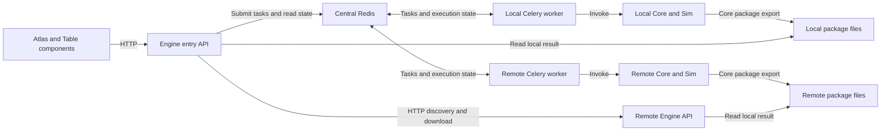

# DTCC Engine backend design

Date: 2026-09-06

Status: Design agreed in discussion; written specification ready for review.

## Purpose and authority

DTCC Engine exposes the Dataset capabilities of DTCC Core and DTCC Sim to
other DTCC Platform components. Atlas and Table are the initial consumers,
including the backend components supporting those experiences. Engine is a
Python integration service, not an application that end users operate directly.

This specification refines [DTCC Twin's design](../../docs/DESIGN.md) and follows
the [repository instructions](../../AGENTS.md) and
[Engine instructions](AGENTS.md). Core remains the authority
for Dataset definitions, DTCC Model semantics, input/output, validation, and
package contracts. Sim owns its simulation methods and specialized numerical
dependencies.

The first release provides discovery, asynchronous execution, job polling,
limited cancellation, and Dataset Package delivery. It delegates task execution
to Celery and uses one central Redis service for the broker and result backend.
It must not grow into a custom task queue, workflow engine, or cluster manager.

## Scope

### Included

- Generic discovery and invocation of all Core and Sim Dataset Definitions,
  including their supported semantic products and parameters within the input
  boundary below. There is no manually curated list of supported Dataset names.
- Requests containing Dataset parameters and geographic bounds.
- Asynchronous execution identified by a job ID, with status obtained by polling.
- Local execution and optional execution on configured remote compute hosts.
- Automatic placement with a local preference, and an explicit target per request.
- Concurrent jobs, limited by a configured job count on each compute host.
- One consumer-facing Engine HTTP address for submission, status, cancellation,
  and package downloads.
- A single shared configurable token for Engine HTTP authentication.
- Results delivered as `.dtccpkg` packages and retained for 30 days after
  completion, subject to the absence of recovery guarantees described below.
- Native Linux and macOS deployments on self-hosted machines or AWS EC2.

Each submitted job invokes one Dataset Definition. Dependencies and processing
steps internal to that Dataset remain in Core or Sim. Engine does not introduce
an application-level pipeline language or independently schedule the internal
stages of a Dataset.

All Datasets are in the integration scope, but availability is specific to an
execution environment. Missing dependencies, credentials, coverage, or canonical
exchange support must be reported where known. A missing upstream capability
does not justify a replacement implementation in Engine or a claim that full
Dataset coverage has been verified.

### Downstream responsibilities

Engine hands completed packages to downstream consumers. Those components own
durable storage, Package Catalogs, publication, access policies for saved data,
Twin Workspaces, Published Twins, and Table Catalog Releases. Engine's temporary
result storage is not a Package Catalog, and downloading or retaining a result
does not publish it.

Table's ordinary visitor experience continues to consume prepared, curated,
published content as specified by Twin's design. This backend does not change
Table into a live generation or simulation client. The initial shared API token
does not enforce different permissions for Atlas and Table.

### Deferred or excluded from v1

- Guaranteed persistence, restart recovery, job resumption, and high availability.
- Uploaded `.dtccpkg` inputs and other user-data upload or import workflows.
- Individual export-file download endpoints; delivery uses `.dtccpkg` only.
- Per-consumer tokens, roles, permissions, and quotas.
- Streaming status, server-sent events, callbacks, and completion webhooks.
- Automatic job retries, failover resubmission, and movement of accepted jobs
  between hosts.
- Guaranteed cancellation of running computations or custom solver interruption.
- CPU- or memory-aware scheduling, distributed capacity reservations, autoscaling,
  dynamic host registration, host provisioning, and SSH execution.
- Compatibility with arbitrary remote service APIs or legacy application layouts.
- Engine-owned serialization, simulation, publication, or domain data models.

## Runtime architecture

One deployment contains:

1. A consumer-facing Engine HTTP service.
2. One central Redis service, configured as Celery's broker and result backend.
3. A Celery worker on each configured compute host, including the local host.
4. The same Engine HTTP service on remote hosts for host-local discovery and
   package retrieval.
5. A temporary package directory on each executing host.

Every compute host installs the same Engine software and the Core/Sim
capabilities available in its environment. The HTTP service and Celery worker
are separate processes from that package. Remote hosts do not require their own
Redis instance. A local-only deployment uses the same architecture with an
empty remote-host list.

Workers execute Core/Sim Python APIs in their own environment. Celery owns the
queue, worker processes, execution state, and worker concurrency. Engine owns
the small amount of application coordination needed to select a configured
target, expose upstream contracts, translate job status, and deliver packages.

There is one job and one Celery task per Dataset invocation. Remote execution
does not create a central task that waits for another task over HTTP. The
selected worker executes the Dataset directly and does not forward it again.

Task dispatch uses the shared broker. Consumer requests, host-local discovery,
and package transfers use HTTP.

## Discovery and compatibility

Dataset descriptors and argument schemas come from Core's public registry and
Dataset interface. Importing Sim contributes its Dataset Definitions through
that same registry. Engine exposes those definitions with application metadata
about configured targets and observed availability. This is a discovery view,
not a competing Dataset registry.

Each target reports its own local capabilities and installed Engine, Core, and
Sim versions. Host-local discovery must not recursively query other hosts.
The consumer-facing service combines this information for discovery and target
selection. A remote-only capability can be discovered without executing it on
the entry host.

The catalog must have an explicit refresh operation or revision mechanism. A
new conforming Dataset using existing contracts becomes visible after it is
installed and registered on a target and the catalog is refreshed, without
Dataset-specific changes to Engine. Installing new Python code may require a
worker restart; discovery is not a promise of arbitrary live code loading.

A target is compatible only when its Dataset contract and execution environment
match the request and the deployment's tested compatibility baseline. Record
the versions used to execute each job and preserve upstream provenance in the
resulting package. Reject incompatible targets rather than silently changing
parameters, semantic products, or model meaning.

Compatibility and canonical exchange readiness must be verified from source,
tests, and representative execution. A descriptor alone is not proof that a
solver is installed, a provider is reachable, or a returned type satisfies
Core's lossless Protobuf contract.

## Routing and concurrency

Remote hosts are configured explicitly with stable target identifiers and their
Engine HTTP addresses. They do not register dynamically. Use a Celery queue for
each configured compute target. Each host's worker consumes its designated
queue and enforces the configured concurrent-job count.

Requests select automatic placement, local execution, or a named remote target.

| Request or condition                                                                | Required behavior                                                                                                                                  |
| ----------------------------------------------------------------------------------- | -------------------------------------------------------------------------------------------------------------------------------------------------- |
| Automatic placement; local host is available, compatible, and has observed capacity | Submit to the local queue.                                                                                                                         |
| Automatic placement; local host is unavailable, lacks capacity, or is incompatible  | Select an available compatible remote host with observed capacity, in configuration order.                                                         |
| All reachable compatible hosts are busy                                             | Queue locally if the local host is compatible and available; otherwise queue on the first available compatible remote host in configuration order. |
| Explicit local or remote target is busy                                             | Queue on that target.                                                                                                                              |
| Explicit target is unavailable, unknown, or incompatible                            | Reject the request with an explanation; do not substitute another target.                                                                          |
| No compatible available target exists                                               | Reject the request with an explanation.                                                                                                            |

Availability means that a target can accept queued work; capacity means that it
appears to have room to start another job. A busy target can still be available.
HTTP liveness alone must not be treated as proof that its Celery worker is ready.

Reported load is a placement hint. Concurrent submissions can observe the same
capacity, so automatic placement does not guarantee immediate execution. Celery
enforces the actual job-count limit. Engine must not add a distributed slot
reservation protocol to make the placement hint exact.

After submission, a job remains assigned to its selected host. There is no
rebalancing, work stealing, or automatic rerouting when that host becomes busy
or unavailable. There are no CPU or memory resource estimates in v1 scheduling.

## Consumer API contract

Engine provides the following operations through its versioned HTTP API. The
implementation plan will select concrete route and module names while
preserving these operation contracts.

| Operation                 | Input                                                                                           | Output                                                                                                                    |
| ------------------------- | ----------------------------------------------------------------------------------------------- | ------------------------------------------------------------------------------------------------------------------------- |
| List or describe Datasets | Optional Dataset identity                                                                       | Upstream descriptors, parameter schemas, supported semantic products, and target availability.                            |
| List compute targets      | No Dataset request required                                                                     | Configured target identifiers, versions, local capabilities, and observed availability.                                   |
| Submit a job              | Dataset name, parameter object including bounds where applicable, and optional execution target | Accepted job ID and a status reference; no wait for Dataset completion.                                                   |
| Get job status            | Job ID                                                                                          | Execution state, available progress, useful error information, cancellation-request information, and result availability. |
| Download a result         | Completed job ID                                                                                | The validated `.dtccpkg` archive.                                                                                         |
| Request cancellation      | Job ID                                                                                          | Whether cancellation was requested, is already resolved, or is unsupported for the job's current execution state.         |

Consumer requests are JSON-compatible descriptions of Dataset invocations. They
do not carry Python model objects, uploaded data, arbitrary code, or arbitrary
execution-host URLs. An explicit execution target must resolve to a configured
identifier.

Core's existing Dataset contract validates Dataset arguments before execution;
Engine validates only its own request envelope and target selection. The
selected target's authoritative contract must be used for validation. Engine
must not maintain hand-written copies of Dataset argument models.

Bounds, units, coordinate reference systems, dimensionality, and parameter
defaults follow the selected Core/Sim Dataset contract. Engine must not
reinterpret numeric bounds as another coordinate system or silently fill
scientific choices using application-specific assumptions.

Semantic product selection remains a Dataset parameter. The delivery container
is `.dtccpkg`; it must not be confused with a Dataset's legacy `format=` path
that returns serialized bytes. Any choice of supplementary package artifacts
must use Core's export contract and must not trigger a second Dataset
computation merely to serialize an existing realization.

Job status distinguishes queued, running, completed, failed, and confirmed
cancelled work. Cancellation being requested is separate information from
confirmation that work was cancelled. Unknown or expired jobs and temporary
status unavailability must be distinguishable from queued work.

Progress reports upstream measurements and messages when available. A running
job without measured progress must not be given an invented percentage or
completion estimate. Consumers obtain updates by polling; streaming is outside
the first release.

## Package creation, delivery, and retention

The worker invokes the Dataset to obtain its native DTCC Model realization with
Dataset Context. It uses Core's object/package export capabilities to create
the `.dtccpkg` archive. It must not duplicate serializers, manifests, package
validation, or Protobuf handling in Engine.

For semantic DTCC data, every delivered package must include:

- An authoritative manifest containing Dataset identity, the exact request,
  provenance, health, warnings, and artifact information.
- A canonical DTCC Protobuf model artifact satisfying Core's versioned,
  lossless model-exchange contract.
- Any additional artifacts provided through Core's package contract, with their
  roles and relationships described by the manifest.

Intrinsic model facts belong in the canonical model. Dataset request and
provenance context belong in the manifest. Consumers use the manifest to select
artifacts rather than infer meaning from filenames. A derived image or mesh
export cannot replace the canonical model artifact.

Before offering a download, use Core's validated package boundary to check the
required content, schema compatibility, model type, and artifact integrity.
Packages under construction must not be exposed as completed results. Required
packaging or integrity failures fail result delivery clearly. A valid
realization remains valid if an optional presentation artifact fails; Core's
contract must determine whether a complete package can be emitted with the
appropriate warning.

The executing host stores the completed package. Redis stores job state and
references to the package and host, not archive contents or in-memory model
objects. The public Engine address serves local files or streams the remote
archive through the remote host's Engine HTTP API. No shared filesystem between
hosts is required, and forwarding a download does not require a second stored
copy at the entry host.

Completed packages expire 30 days after job completion, measured as 30 periods
of 24 hours using UTC timestamps. Downloads do not extend that period. Under
normal operation, job-result metadata must remain available throughout the
package retention window. Each host must automatically clean up expired package
files; broker metadata expiry alone is insufficient. Host outages can delay physical cleanup,
but expired packages must not become newly available merely because their files
remain on disk.

The 30-day period is a temporary retention policy, not a persistence guarantee.
Downstream consumers must store results they need to retain durably.

## Failures, cancellation, and restarts

### Failure reporting

- Invalid requests fail before submission, with the selected Dataset's useful
  validation details.
- Dataset failures and required package-creation failures produce failed jobs.
  Incomplete packages are not downloadable.
- Failed jobs require explicit consumer resubmission. Engine adds no automatic
  execution retries or failover resubmission.
- Broker or host communication failure means the latest state may be
  unavailable. It must not be reported as proof that the computation failed or
  stopped. If submission acknowledgement is lost, acceptance can be uncertain;
  Engine must not silently submit the job again.
- An unknown or expired job ID is identified explicitly. Celery's `PENDING`
  value alone cannot establish that a job was accepted and is queued, as
  documented in its [task states](https://docs.celeryq.dev/en/stable/userguide/tasks.html#pending).
- Returning an error must not expose the API token, provider credentials, or
  unrestricted internal tracebacks. Operational diagnostics can retain the
  information needed to investigate the job.

No exactly-once execution or duplicate-submission guarantee is introduced by
this specification. Broker reconnection and read-only status polling do not
constitute permission for Engine to retry a Dataset computation.

### Cancellation

V1 supports best-effort cancellation before execution starts, using existing
Celery facilities. If cancellation races with execution starting, the job may
run. Accepting a cancellation request must not be presented as proof that
running work has stopped.

Running-job cancellation is deferred. Engine must not copy the existing Sim
service's programmatic `terminate=True` behavior as a general cancellation API.
Celery's [worker documentation](https://docs.celeryq.dev/en/stable/userguide/workers.html#revoke-revoking-tasks)
explains that this terminates a worker process and can affect a different task
if that process has already moved on. Confirmation and race handling must be
checked against the selected Celery version before exposing a
terminal cancelled state.

No custom interruption hooks, process-management framework, or solver-specific
cancellation implementation are included in the first release.

### Restart behavior

V1 provides **no guaranteed recovery after restart** for queued jobs, running
jobs, job records, or completed packages. It does not deliberately cancel jobs
or delete surviving results simply because the HTTP API restarts. Usable work
that survives through the broker, workers, or filesystem can remain usable.

There is no additional coordination mechanism whose purpose is to erase
surviving jobs. Guaranteed persistence, recovery, and resumption are explicitly
deferred requirements for a later release.

## Deployment and authentication

The deployment targets are native Linux and macOS, on self-hosted machines or
AWS EC2. Containers and Kubernetes are not required. Use existing process
supervision and Celery operations rather than building a service manager into
Engine.

Configuration supplies the central broker/result-backend connection, one
shared Engine HTTP token, the local target identity, the static remote-target
list, per-host concurrent-job limits, and local temporary result directories.
All Engine HTTP services use the shared token; there are no per-consumer roles.
Broker connectivity has its own deployment configuration and protection; an
HTTP API token is not a Redis authentication protocol.

Compute hosts need connectivity to central Redis. The entry service needs HTTP
connectivity to remote Engine APIs for discovery and result transfer. Consumers
need only the entry service's HTTP address. Public-network deployments must
protect credentials and data in transit through their deployment configuration.

Use a verified, compatible set of Engine, Core, Sim, Celery, and Python versions.
An environment that can import Dataset descriptors is not automatically a
working numerical execution environment. Native worker execution and the
specialized Sim dependencies must be exercised on the supported platforms;
platform limitations must be stated explicitly.

## Upstream inspection and implementation prerequisites

The following observations come from the local reference checkouts inspected
during planning. They are source observations, not claims of passing runtime
tests or a verified release combination.

| Reference                           | Inspected revision                         |
| ----------------------------------- | ------------------------------------------ |
| `temp/dtcc-core/`, branch `develop` | `61b2015ed6632757dcd67ccf3f97d8768e6776e6` |
| `temp/dtcc-sim/`, branch `develop`  | `78093e7e10a4d4a5695fcf3242560fb60ea4d5d5` |

### Reusable interfaces

- Core's `dtcc_core/datasets/registry.py` exposes the shared Dataset registry.
  `DatasetDescriptor` in `dtcc_core/datasets/dataset.py` provides validation,
  invocation, descriptions, and parameter schemas. Its public `Dataset` alias
  and actual contracts must be checked against the selected dependency revision.
- Sim's `dtcc_sim/datasets.py` contributes Dataset subclasses through Core's
  registration mechanism.
- Core's model `export()` delegates to
  `dtcc_core/datasets/package.py:export_model_package`. This is the package
  creation boundary to reuse and improve upstream where necessary.
- Sim's `service/tasks.py` already integrates Dataset invocation with Celery;
  `service/progress.py` bridges Core's progress callback to task state.
  `service/routes.py` demonstrates discovery, submission, polling, and
  cancellation. Reuse suitable public interfaces or separately propose making
  reusable pieces public; do not assume service internals are stable APIs.

### Required upstream and integration work

1. **Canonical package content belongs in Core.** The inspected exporter writes
   a manifest and the selected artifact format, including companion files. It
   does not automatically add a canonical Protobuf artifact. For example, its
   City package tests permit `manifest.json` plus `artifacts/city.json` only.
   Resolve canonical Protobuf inclusion in Core before claiming compliant
   Engine package delivery. Do not implement a competing package writer in
   Engine.
2. **Model exchange readiness belongs in Core, with Sim integration where
   applicable.** Verify that each exposed semantic result type satisfies the
   Protobuf round-trip contract, and that Core provides the package validation
   and reading operations needed by Engine. The inspected transitional
   `DatasetCollection` and `DatasetValue` classes explicitly lack Protobuf
   serialization. Their existence does not prove that a current public Dataset
   returns them, so verify actual Dataset results rather than inferring a
   blanket failure. Missing semantics or codecs require upstream resolution.
3. **Dependency alignment must be verified.** The inspected Sim `pyproject.toml`
   pins Core to `9774162563d94a038a9ae799495020101b8250d7`, which differs from the
   inspected Core checkout. Establish and test a compatible dependency baseline
   before writing integrations that assume these revisions work together.
4. **Remote delivery needs an Engine integration boundary.** Core's existing
   `RemoteDatasetDescriptor` waits for completion and reads serialized results
   from a shared filesystem. Sim's result handler writes individual formats or
   tar archives. These do not directly satisfy asynchronous job submission and
   `.dtccpkg` delivery over HTTP. Do not reuse them unchanged or restore their
   legacy shared-volume assumptions. The required Engine HTTP adapter handles
   discovery and transport while Core retains package semantics.
5. **Cancellation behavior must be verified.** Sim's existing endpoint calls
   Celery revoke with forced process termination. V1 intentionally uses the
   narrower cancellation contract above. Verify queued-task races and state
   reporting against the selected Celery version.

Reference checkouts remain unmodified during Engine work. Missing shared
capabilities require separately proposed Core or Sim changes. The implementation
plan must revisit relevant source, tests, and examples when assumptions or
dependency versions change. It must not hide unresolved upstream requirements
behind Engine-specific fallbacks.

## Acceptance and validation

The primary acceptance scenario is: a consumer discovers a Dataset, submits
valid parameters, polls the job, and downloads a validated `.dtccpkg` through
one Engine address, whether execution was local or remote.

| Area                 | Required evidence                                                                                                                                                                               |
| -------------------- | ----------------------------------------------------------------------------------------------------------------------------------------------------------------------------------------------- |
| Generic discovery    | Installed Core and Sim Dataset Definitions are exposed from the shared contracts; adding a conforming definition becomes visible after refresh without Dataset-specific Engine code.            |
| Validation           | Invalid parameters, bounds, unknown targets, and incompatible targets fail clearly before execution; selected-target validation matches Core.                                                   |
| Local execution      | A representative Core job runs through the real broker and worker, reports state, and produces a valid package.                                                                                 |
| Simulation execution | Representative Sim jobs run with their actual numerical dependencies and preserve their model fields and provenance in the package.                                                             |
| Remote execution     | The selected remote worker executes the job directly; status and package download remain available through the entry address without a shared filesystem.                                       |
| Routing              | Automatic local preference, configured remote ordering, explicit targets, and all-hosts-busy queueing follow the routing table.                                                                 |
| Concurrency          | Concurrent submissions never cause a host to execute more Dataset jobs than its configured worker limit, including when capacity observations race.                                             |
| Polling              | Queued and running jobs are distinguishable; upstream progress is retained; missing progress is not fabricated; unknown IDs are not reported as queued.                                         |
| Failure reporting    | Dataset, required packaging, broker, and host failures produce the specified outcomes without automatic Dataset resubmission or false claims that work stopped.                                 |
| Cancellation         | Pre-execution cancellation and the start/cancel race are exercised; acceptance is distinct from confirmed cancellation; running-job cancellation is reported as unsupported.                    |
| Package correctness  | Core validation confirms manifest integrity, required canonical Protobuf content, and supported schema/root type; model-level tests demonstrate lossless round trips.                           |
| Retention            | Completed packages remain retrievable during the 30-day retention window under normal operation, expire from the completion time, and are physically cleaned up; downloads do not reset expiry. |
| Restart behavior     | Separate API, worker, and broker restarts do not promise recovery or force deletion of surviving work; unavailable and unknown state are reported honestly.                                     |
| Authentication       | HTTP endpoints reject missing or invalid tokens and accept the configured token; remote discovery and delivery use the same authentication policy.                                              |
| Native deployment    | Linux and macOS worker setups are exercised, including real Core/Sim dependencies; unavailable environments and unverified capabilities are explicitly reported.                                |

Use focused contract tests for API translation and routing, and integration
tests with real Redis and Celery for process and broker behavior. Test doubles
alone cannot establish cancellation, concurrency, or native numerical execution
correctness. A deterministic Core Dataset is useful for routine checks, but it
does not replace real Sim or canonical package verification.

No numeric performance targets have been agreed. Record baseline submission
latency, queue wait, execution duration, concurrent-job behavior, package size,
and local/remote transfer measurements for representative jobs, together with
the hardware and software versions. Use these measurements to inform later
targets; do not present measurements as previously agreed performance limits.

Validation reports must distinguish passed, failed, skipped, and not-run checks.
This specification records intended behavior. No Engine implementation or
runtime validation was performed as part of writing it.

## Required contents of the implementation plan

The plan must preserve the agreed scope and dependency ownership. Begin with
upstream contract and dependency verification, then organize the Engine work
into testable increments for discovery, local execution and packaging, remote
targets and delivery, lifecycle behavior, and native deployment verification.

Every increment must identify the public upstream interfaces it relies on,
the checks that demonstrate its behavior, and any unresolved upstream blocker.
Do not invent missing APIs in example implementation code. Keep the initial
modules cohesive and avoid abstractions added only for hypothetical future
backends or schedulers.

Guaranteed persistence and restart recovery must appear explicitly as deferred
work in that plan. They must not be silently added through this release's
30-day retention requirement or removed from the recorded future scope.

## Supporting references

- [Core Dataset contract and package design](../../temp/dtcc-core/DESIGN.md).
- [Core Dataset registration tests](../../temp/dtcc-core/tests/datasets/test_dataset_registration.py).
- [Core object package-export tests](../../temp/dtcc-core/tests/datasets/test_object_export_package.py).
- [Sim service route tests](../../temp/dtcc-sim/tests/test_service_routes.py).
- [Celery task queues and worker model](https://docs.celeryq.dev/en/stable/getting-started/introduction.html#what-s-a-task-queue).
- [Celery queue routing](https://docs.celeryq.dev/en/stable/userguide/routing.html).
- [Celery worker concurrency](https://docs.celeryq.dev/en/stable/userguide/workers.html#concurrency).
- [Celery revocation and termination limits](https://docs.celeryq.dev/en/stable/userguide/workers.html#revoke-revoking-tasks).
- [Celery task states, including unknown tasks](https://docs.celeryq.dev/en/stable/userguide/tasks.html#pending).
- [Celery result retention](https://docs.celeryq.dev/en/stable/userguide/configuration.html#std:setting-result_expires).

The relative Core and Sim links refer to the ignored reference checkouts created
according to Engine's repository instructions. The recorded revisions identify
the inspected source; implementation must recheck the selected versions.
